# 创建工程

## **1 安装软件**：

KEIL MDK5	（已提前安装完成）

## 2 安装芯片包

下载地址：

[**Arm Keil | Keil STM32F4xx_DFP**](https://www.keil.arm.com/packs/stm32f4xx_dfp-keil/overview/)  **←  Ctrl+左键直达网站**

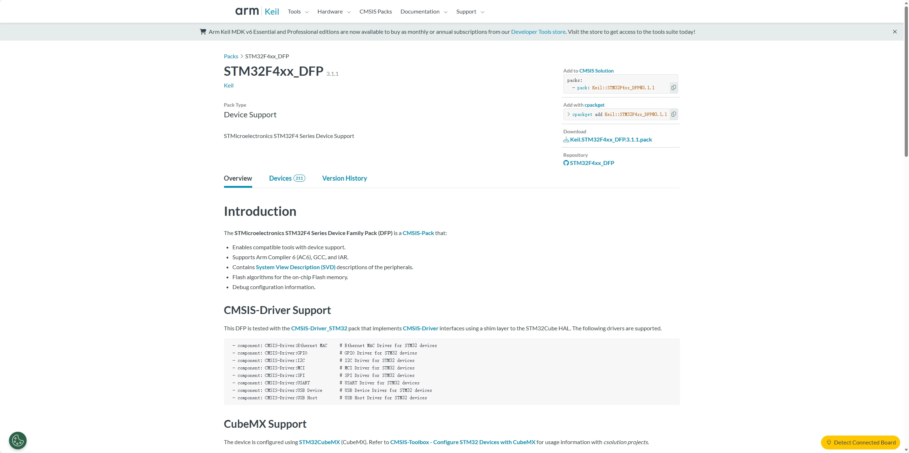

下载的包名：

​	[**Keil.STM32F4xx_DFP.3.1.1.pack**](../资源)  **←  Ctrl+左键直达本地**

## 3 下载固件库

ST 官方 `STM32CubeF4` HAL 库固件包

下载地址：

​	[**STM32CubeF4 | 产品 - 意法半导体**](https://www.st.com.cn/zh/embedded-software/stm32cubef4.html#)    **←  Ctrl+左键直达网站**

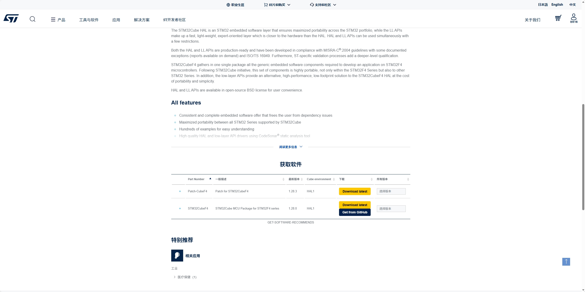

下载的包名：[**stm32cubef4-v1-28-0.zip**](../资源)  **←  Ctrl+左键直达本地**

## 4 安装Pack包

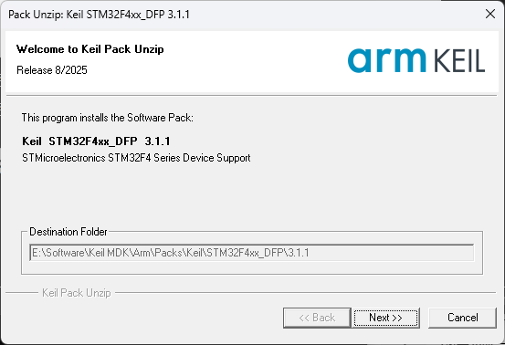

## 5 创建HAL 工程

​	参考资料：
​	1.[《STM32F407 探索者开发指南》第八章 新建HAL版本MDK工程](http://47.111.11.73/thread-344334-1-1.html)

​	2. [8，STM32参考资料.zip](../资源)  **←  Ctrl+左键直达本地**

1. 新建工程文件夹

     新建一个工程根目录文件夹，后续的工程文件都将在这个文件夹里建立，我们把这个文件夹重命名为：==F407_HAL_Project==

     

     在工程根目录文件夹下建立以下几个文件夹:

     ==Drivers==	   存放与硬件相关的驱动层文件

     ==Middlewares==  存放正点原子提供的中间层组件文件和第三方中间层文件

     ==Output==	  存放工程编译输出文件

     ==Projects==	 存放MDK工程文件

     ==User==	      存放HAL库用户配置文件、main.c、中断处理文件，以及分散加载文件，首先从官方固件包里面直接拷贝官方的模板工程下的HAL库用户配置文件和中断处理文件到我们的User文件夹里。官方的模板工程路径：STM32Cube_FW_F4_V1.26.0\Projects\STM324xG_EVAL\Templates

     

     另外工程根文件目录下还有一个名为keilkill.bat的可执行文件，双击便可执行。其作用是删除编译器编译后的无关文件，减少工程占用的内存，方便打包。

     [keilkill.bat](../资源)  **←  Ctrl+左键直达本地**

2. 拷贝工程相关文件

     接下来，我们按根目录文件夹顺序介绍每个文件夹及其需要拷贝的文件。

     

     Drivers文件夹

     该文件夹用于存放与硬件相关的驱动层文件，一般包括三个文件夹，新建文件夹：

     ==BSP==		存放板级支持包驱动代码，如各种外设驱动

     ==CMSIS== 	用于存放CMSIS底层代码，如启动文件（.s）、stm32f4xx.h等

     ==SYSTEM==	存放系统级核心驱动代码

     ==STM32F4xx_HAL_Driver==	用于存放ST提供的F4xx HAL库驱动代码

     

     Middlewares文件夹

     该文件夹用于存放第三方提供的中间层代码（组件/Lib等），如：USMART、MALLOC、TEXT、FATFS、USB、LWIP、各种OS、各种GUI等等。

     

     Output文件夹

     该文件夹用于存放编译器编译工程输出的中间文件

     

     Projects文件夹

     该文件夹用于存放编译器（MDK、IAR等）工程文件，新建文件夹：
     ==MDK-ARM==	用于存放MDK的工程文件

     

     User文件夹

     存放HAL库用户配置文件、main.c、中断处理文件，以及分散加载文件

3. 拷贝官方HAL库用户配置文件和中断处理文件到 USER 文件夹里，解压 资源 文件夹中的 stm32cubef4-v1-28-0.zip 压缩包，进入<u>stm32cubef4-v1-28-0\STM32Cube_FW_F4_V1.28.0\Projects\STM324xG_EVAL\Templates</u>文件夹下，在 Inc 和 Src 这两个文件夹里面找到：stm32f4xx_it.c、stm32f4xx_it.h、stm32f4xx_hal_conf.h这三个文件，并且拷贝到我们的User文件夹下。

4. 新建工程框架

     打开MDK软件。然后点击Project → New uVision Project ，然后弹出工程命名和保存的操作窗口，我们将工程文件保存路径设置在上一节新建的工程文件夹内，具体路径为：SimWheel\Code\STM32\F407_HAL_Project\Projects\MDK-ARM，工程名字我们取：F407_Project，最后点击保存即可。

     

     之后，弹出器件选择对话框，我们选择：STMicroelectronics → STM32F4 Series → STM32F407 → STM32F407VETx ,点击OK，MDK会弹出Manage Run-Time Environment对话框,点击 Cancel 关闭。此时，打开MDK-ARM文件夹，会看到MDK在该文件夹下自动创建了3个文件夹：
     DebugConfig	用于存放调试设置信息文件（.dbgconf），不可删除

     Listings	用于存放编译过程产生的链接列表等文件（待删除）

     Objects	用于存放编译过程产生的调试信息、.hex、预览、.lib文件等（待删除）

5. 设置工程名和分组名

     在菜单栏点击品字形红绿白图标，设置工程名字为：Template，并设置四个分组：Startup、User、Drivers/SYSTEM、Drivers/STM32F4xx_HAL_Driver、Drivers/BSP、Readme

     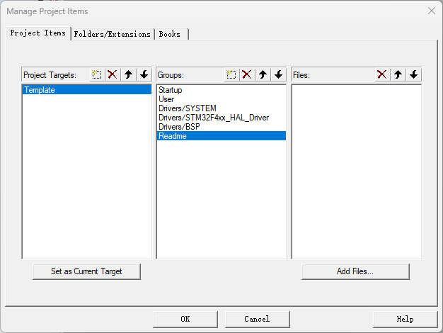

     

     

     

6. 添加启动文件

     因为我们开发板使用的是STM32F407VET6，对应的启动文件为：**startup_stm32f407xx.s**，双击Startup，添加启动文件，将stm32cubef4-v1-28-0\STM32Cube_FW_F4_V1.28.0\Drivers\CMSIS\Device\ST\STM32F4xx\Source\Templates\arm 中的 startup_stm32f407xx.s 添加

     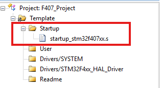

7. 添加SYSTEM源码

     双击Drivers/SYSTEM分组，依次添加delay.c、sys.c和usart.c到该分组下，（该文件可以从正点原子的：A盘→4，程序源码→1，标准例程-HAL库版本 文件夹里面的任何一个实验的Drivers文件夹里面拷贝过来）

     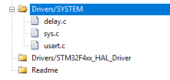

8. 添加User源码

     依次添加stm32f4xx_it.c和system_stm32f4xx.c到该分组下

     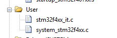

9. 添加STM32F4xx_HAL_Driver源码

     把Drivers\STM32F4xx_HAL_Driver\Src下的除了文件夹的其他所有.c都添加

     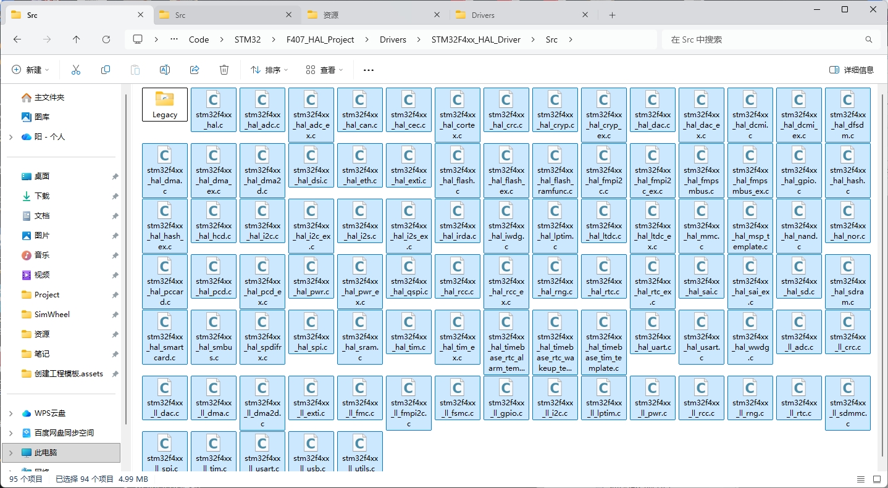

10. 设置Target选项卡

     设置芯片所使用的外部晶振频率为8Mhz，选择ARMCompiler版本为：Usedefault compiler version 5（即AC5编译器）

     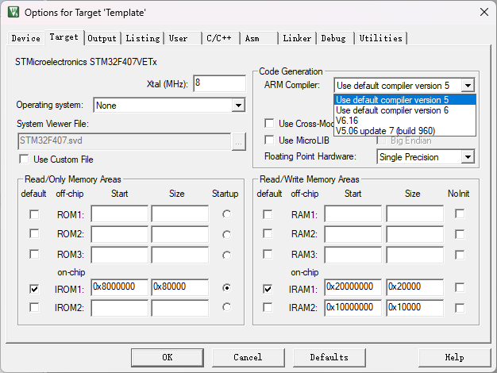

11. 设置Output选项卡

     Select Folderfor Objects 选择输出位置为 Output 文件夹，并勾选“生成.hex文件巴拉巴拉”

     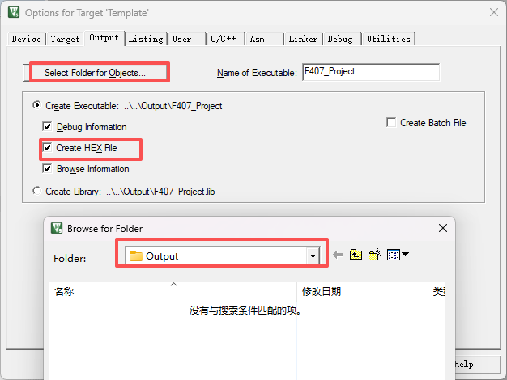

12. 设置Listing选项卡

     Select Folderfor Listing 选择输出位置为 Output 文件夹

     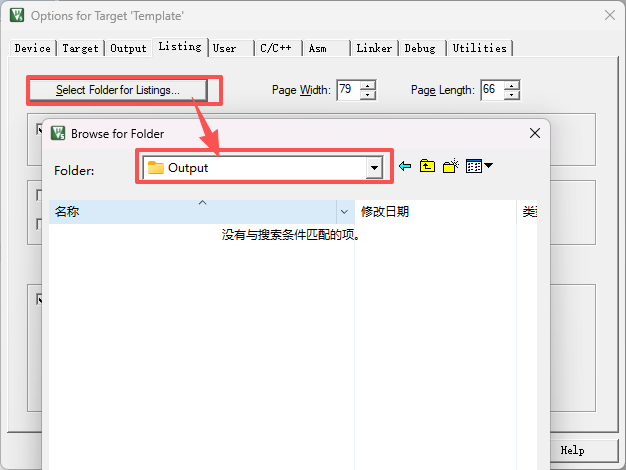

13. 设置C/C++选项卡

     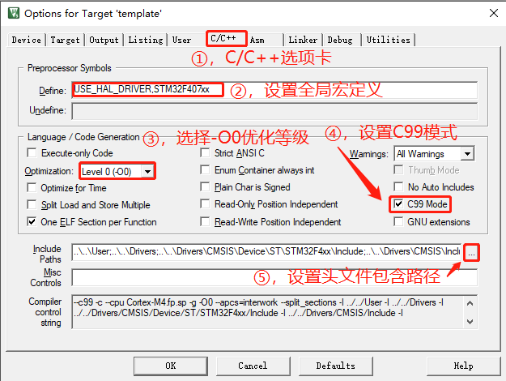

     在②处设置了全局宏定义：STM32F407xx，用于定义所用STM32型号，在stm32f4xx.h里面会用到该宏定义。

     在③处设置了优化等级为-O0，可以得到最好的调试效果，当然为了提高优化效果提升性能并降低代码量，可以设置-O1~-O3，数字越大效果越明显，不过也越容易出问题。注意：当使用AC6编译器的时候，这里推荐默认使用-O1优化。

     在④处勾选C99模式，即使用C99 C语言标准。

     在⑤处，我们可以进行头文件包含路径设置，点击此按钮

     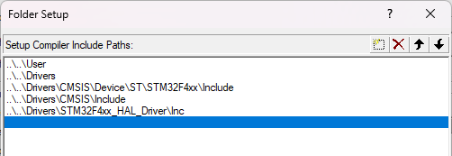

     上图中我们设置了6个头文件包含路径，其中3个在Drivers文件夹下，一个在User文件夹下，一个在Middlewares文件夹下。为避免频繁设置头文件包含路径，正点原子最新源码的include全部使用相对路径，也就是我们只需要在头文件包含路径里面指定一个文件夹，那么该文件夹下的其他文件夹里面的源码，如果全部是使用相对路径，则无需再设置头文件包含路径了，直接在include里面就指明了头文件所在。

     关于相对路径，这里大家记住3点：

     1，默认路径就是指MDK工程所在的路径，即.uvprojx文件所在路径（文件夹）

     2，“./”表示当前目录（相对当前路径，也可以写做“.\”）

     3，“../”表示当前目录的上一层目录（也可以写做“..\”）

     举例来说，上图中：..\..\Drivers\CMSIS\Device\ST\STM32F4xx\Include，前面两个“..\”，表示Drivers文件夹在当前MDK工程所在文件夹（MDK-ARM）的上2级目录下，具体解释如图8.1.4.6所示：

     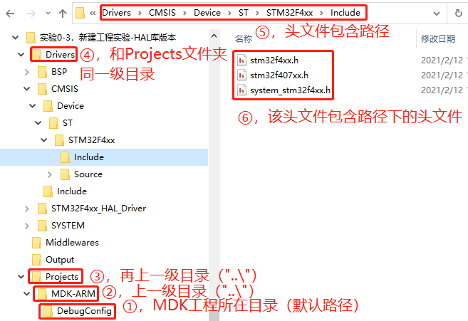

14. 设置Utilities选项卡

     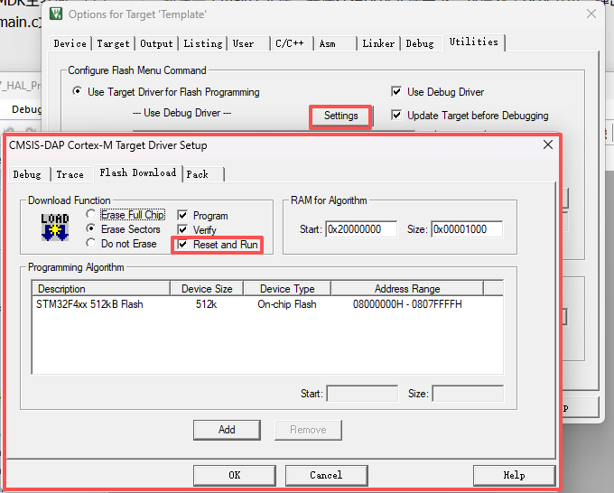

15. 添加main.c，并编写代码

     双击 User 组，新建main.c文件，并保存在User文件夹下

     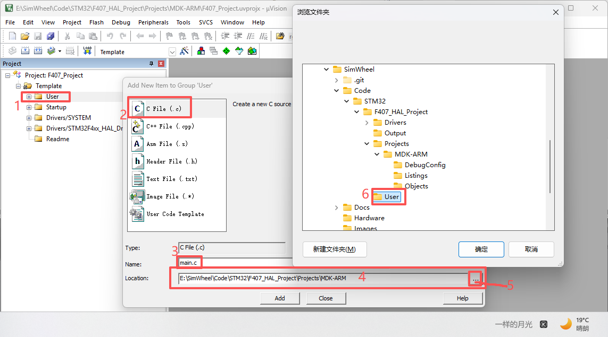

16. .

17. .

18. .

19. .

20. .

21. ..

22. .

23. .